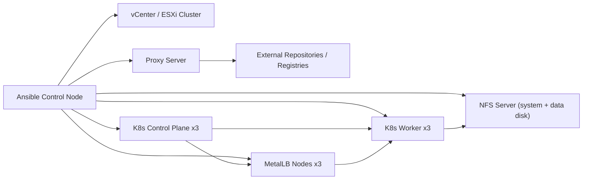

## Задача: Архитектура и требования к Ansible-плейбуку Kubernetes на RedOS
- **Статус**: В процессе
- **Описание**: Сформировать целевую архитектуру, технические требования и стандарты реализации унифицированного и идемпотентного Ansible-плейбука для развертывания Kubernetes-кластера в VMware ESXi/vCenter в изолированной сети.

# Project.md

## 1. Цели проекта
- Подготовить единый Ansible-плейбук для автоматизированного развертывания Kubernetes-кластера на RedOS 8.0.2.
- Реализовать идемпотентный и воспроизводимый процесс установки и настройки инфраструктуры.
- Обеспечить безопасность (firewalld, SELinux, секреты, ограничение доступа) и производительность (стабильные роли, контроль ресурсов, минимизация ручных действий).
- Поддержать изолированный контур через прокси для доступа к внешним пакетным репозиториям.

## 2. Исходные ограничения и контекст
- Платформа виртуализации: VMware ESXi с централизованным управлением через vCenter.
- ОС узлов Kubernetes: RedOS 8.0.2.
- Сетевая среда: изолированная, доступ в интернет только через прокси.
- Состав кластера:
  - 3 узла `control-plane`.
  - 3 узла `worker`.
  - 3 узла для `MetalLB` (выделенная группа нод под ingress-трафик).
- Персистентное хранилище: NFS-сервер с двумя дисками (system + data).

## 3. Архитектурные принципы
- `KISS`: роли и плейбуки должны быть простыми и читаемыми.
- `DRY`: повторяемые действия вынести в роли, переменные и шаблоны.
- `SOLID` (на уровне модулей/ролей): каждая роль решает одну зону ответственности.
- Идемпотентность:
  - все задачи имеют корректные `changed_when`/`failed_when` при необходимости;
  - повторный запуск не ломает существующую конфигурацию;
  - изменения вносятся декларативно и проверяемо.

## 4. Целевая архитектура (логическая)



## 5. Целевые компоненты и зоны ответственности
- `base_os`: базовая подготовка RedOS (time sync, packages, kernel params).
- `proxy`: настройка системного и пакетного прокси (`dnf`, `container runtime`, systemd env).
- `container_runtime`: установка и настройка containerd/CRI-O (уточняется).
- `kubernetes_core`: kubeadm/kubelet/kubectl, bootstrap control-plane, join worker.
- `networking`: CNI-плагин (Calico/Cilium/Flannel, уточняется) и сетевые политики.
- `metallb`: установка и настройка MetalLB с адресными пулами для ingress.
- `security_hardening`:
  - firewalld (минимально необходимые порты по ролям нод),
  - SELinux (Enforcing + корректные контексты/booleans),
  - базовые системные hardening-параметры.
- `storage_nfs`: подготовка NFS и StorageClass/PV/PVC для персистентных данных.
- `validation`: smoke/e2e проверки, валидация health и идемпотентности.

## 6. Предлагаемая структура Ansible-репозитория
```text
inventories/
  prod/
    hosts.yml
    group_vars/
      all.yml
      control_plane.yml
      workers.yml
      metallb.yml
      nfs.yml
playbooks/
  site.yml
  bootstrap.yml
  hardening.yml
  storage.yml
  validate.yml
roles/
  base_os/
  proxy/
  container_runtime/
  kubernetes_core/
  networking/
  metallb/
  security_hardening/
  storage_nfs/
  validation/
```

## 7. Этапы реализации
1. Сбор входных данных и согласование параметров среды.
2. Подготовка inventory и групповых переменных.
3. Базовая подготовка ОС + прокси.
4. Установка container runtime + Kubernetes.
5. Настройка сети кластера и MetalLB.
6. Настройка NFS и персистентного хранилища.
7. Настройка firewalld/SELinux.
8. Автоматические проверки, тест идемпотентности, эксплуатационная документация.

## 8. Стандарты и поддерживаемость
- Проверки качества:
  - `ansible-lint`;
  - `yamllint`;
  - `--check`/`--diff` режимы для безопасной валидации.
- Секреты и чувствительные данные:
  - хранить в `ansible-vault`;
  - исключить plaintext-пароли/токены из git.
- Консистентность:
  - единые naming-conventions для ролей/переменных;
  - единая схема тегов (`base`, `k8s`, `security`, `storage`, `validate`);
  - документирование изменений в `docs/changelog.md` и `docs/Tasktracker.md`.

## 9. Требования к безопасности
- Минимально необходимые открытые порты по ролям нод.
- SELinux в режиме `Enforcing` (исключения только по согласованию).
- Доступ Ansible через выделенного операционного пользователя с ограниченными правами + sudo.
- Контроль источников пакетов/образов в условиях прокси и изолированного контура.

## 10. Требования к производительности
- Настройки sysctl и runtime под Kubernetes-нагрузку.
- Контроль CPU/RAM reservations для control-plane и worker в VMware.
- Минимизация времени повторного прогона за счет идемпотентных проверок.

## 11. Правило актуализации
- Файл обновляется при:
  - изменении архитектуры;
  - добавлении новых функциональных требований;
  - смене технологического стека или стандартов.
