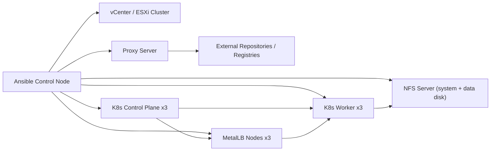

## Задача: Архитектура и требования к Ansible-плейбуку Kubernetes на RedOS
- **Статус**: В процессе
- **Описание**: Сформировать целевую архитектуру, технические требования и стандарты реализации унифицированного и идемпотентного Ansible-плейбука для развертывания Kubernetes-кластера в VMware ESXi/vCenter в изолированной сети.

# Project.md

## 1. Цели проекта
- Подготовить единый Ansible-плейбук для автоматизированного развертывания Kubernetes-кластера на RedOS 8.0.2.
- Реализовать идемпотентный и воспроизводимый процесс установки и настройки инфраструктуры.
- Обеспечить безопасность (firewalld, SELinux, секреты, ограничение доступа) и производительность (стабильные роли, контроль ресурсов, минимизация ручных действий).
- Поддержать изолированный контур через прокси для доступа к внешним пакетным репозиториям.

## 2. Исходные ограничения и контекст
- Платформа виртуализации: VMware ESXi с централизованным управлением через vCenter.
- ОС узлов Kubernetes: RedOS 8.0.2.
- Сетевая среда: изолированная, доступ в интернет только через прокси.
- Состав кластера:
  - 3 узла `control-plane`.
  - 3 узла `worker`.
  - 3 узла для `MetalLB` (выделенная группа нод под ingress-трафик).
- Персистентное хранилище: NFS-сервер с двумя дисками (system + data).

## 3. Архитектурные принципы
- `KISS`: роли и плейбуки должны быть простыми и читаемыми.
- `DRY`: повторяемые действия вынести в роли, переменные и шаблоны.
- `SOLID` (на уровне модулей/ролей): каждая роль решает одну зону ответственности.
- Идемпотентность:
  - все задачи имеют корректные `changed_when`/`failed_when` при необходимости;
  - повторный запуск не ломает существующую конфигурацию;
  - изменения вносятся декларативно и проверяемо.

## 4. Целевая архитектура (логическая)



## 5. Целевые компоненты и зоны ответственности
- `base_os`: базовая подготовка RedOS (time sync, packages, kernel params).
- `proxy`: настройка системного и пакетного прокси (`dnf`, `container runtime`, systemd env).
- `container_runtime`: установка и настройка containerd/CRI-O (уточняется).
- `kubernetes_core`: kubeadm/kubelet/kubectl, bootstrap control-plane, join worker.
- `networking`: CNI-плагин (Calico/Cilium/Flannel, уточняется) и сетевые политики.
- `metallb`: установка и настройка MetalLB с адресными пулами для ingress.
- `security_hardening`:
  - firewalld (минимально необходимые порты по ролям нод),
  - SELinux (Enforcing + корректные контексты/booleans),
  - базовые системные hardening-параметры.
- `storage_nfs`: подготовка NFS и StorageClass/PV/PVC для персистентных данных.
- `validation`: smoke/e2e проверки, валидация health и идемпотентности.

## 6. Предлагаемая структура Ansible-репозитория
```text
inventories/
  prod/
    hosts.yml
    group_vars/
      all.yml
      control_plane.yml
      workers.yml
      metallb.yml
      nfs.yml
playbooks/
  site.yml
  bootstrap.yml
  hardening.yml
  storage.yml
  validate.yml
  reinstall_cluster_and_nfs.yml
roles/
  base_os/
  proxy/
  container_runtime/
  kubernetes_core/
  networking/
  metallb/
  security_hardening/
  storage_nfs/
  validation/
```

## 7. Этапы реализации
1. Сбор входных данных и согласование параметров среды.
2. Подготовка inventory и групповых переменных.
3. Базовая подготовка ОС + прокси.
4. Установка container runtime + Kubernetes.
5. Настройка сети кластера и MetalLB.
6. Настройка NFS и персистентного хранилища.
7. Настройка firewalld/SELinux.
8. Автоматические проверки, тест идемпотентности, эксплуатационная документация.

## 8. Стандарты и поддерживаемость
- Проверки качества:
  - `ansible-lint`;
  - `yamllint`;
  - `--check`/`--diff` режимы для безопасной валидации.
- Секреты и чувствительные данные:
  - хранить в `ansible-vault`;
  - исключить plaintext-пароли/токены из git.
- Консистентность:
  - единые naming-conventions для ролей/переменных;
  - единая схема тегов (`base`, `k8s`, `security`, `storage`, `validate`);
  - документирование изменений в `docs/changelog.md` и `docs/Tasktracker.md`.

## 9. Требования к безопасности
- Минимально необходимые открытые порты по ролям нод.
- SELinux в режиме `Enforcing` (исключения только по согласованию).
- Доступ Ansible через выделенного операционного пользователя с ограниченными правами + sudo.
- Контроль источников пакетов/образов в условиях прокси и изолированного контура.
- Прокси-конфигурация должна быть параметризуемой и отключаемой для неизолированных контуров.
- Для NFS-сервера должна поддерживаться опциональная разметка и монтирование выделенного диска под export path.
- Для NFS data-disk сценария должна действовать защита от выбора системного диска (с явным override-параметром).

## 10. Требования к производительности
- Настройки sysctl и runtime под Kubernetes-нагрузку.
- Контроль CPU/RAM reservations для control-plane и worker в VMware.
- Минимизация времени повторного прогона за счет идемпотентных проверок.

## 11. Правило актуализации
- Файл обновляется при:
  - изменении архитектуры;
  - добавлении новых функциональных требований;
  - смене технологического стека или стандартов.

## 12. Зафиксированные параметры среды (по состоянию на 2026-02-19)

### 12.1 VMware
- vCenter: `7.0.3`
- ESXi: `7.0.3`
- Режим подготовки VM: `clone_from_template`
- Шаблон: `k8s-pcp-template`
- Datacenter: `Eleksir`
- Cluster: `North`
- Datastore: `North_Datastore01_vol_02`
- Portgroup: `10.255.106.0/26_424`
- Ресурсы ВМ:
  - `control-plane`: `2 vCPU`, `4 GB RAM`, `50 GB system disk`
  - `worker`: `4 vCPU`, `8 GB RAM`, `50 GB system disk`
  - `metallb`: `2 vCPU`, `4 GB RAM`, `50 GB system disk`

### 12.2 Kubernetes и сеть
- Kubernetes: `1.30.14`
- Runtime: `containerd`
- CNI: `calico`
- Control plane endpoint: `10.255.106.20`
- Management CIDR: `10.255.106.0/26`
- Pod CIDR: `10.245.0.0/16`
- Service CIDR: `10.246.0.0/16`
- Узлы:
  - `k8s-scp-01`: `10.255.106.10`
  - `k8s-scp-02`: `10.255.106.11`
  - `k8s-scp-03`: `10.255.106.12`
  - `k8s-wkn-01`: `10.255.106.13`
  - `k8s-wkn-02`: `10.255.106.14`
  - `k8s-wkn-03`: `10.255.106.15`
  - `k8s-mlb-01`: `10.255.106.16`
  - `k8s-mlb-02`: `10.255.106.17`
  - `k8s-mlb-03`: `10.255.106.18`
  - `k8s-nfs-01`: `10.255.106.19`

### 12.3 MetalLB и ingress
- MetalLB mode: `l2`
- Address pool: `10.255.106.21-10.255.106.30` (`pcidss-lan`)
- Ingress controller: `nginx`
- Выделенные ноды под MetalLB ingress: `k8s-mlb-01..03`
- Labels на MetalLB-нодах: `node-role.kubernetes.io/metallb=true`
- Taints на MetalLB-нодах: отсутствуют
- Ограничение прав: нет доступа к изменению сетевых настроек в `vCenter`.
- Публикация ресурсов выполняется через `Service type=LoadBalancer` с выдачей `VIP` из пула MetalLB.
- В режиме `l2` VIP не назначается как обычный адрес интерфейса; трафик доставляется через ARP/NDP анонс от `metallb-speaker`.
- Рекомендация для ingress: закрепить статический VIP (`10.255.106.21`) за сервисом ingress.
- Обязательные внешние условия без vCenter-изменений:
  - VIP-диапазон должен быть зарезервирован в IPAM/DHCP и не использоваться другими хостами.
  - Должна быть сетевая достижимость клиентов до VIP (L2/L3 маршрут).
  - На периметре должен быть разрешен доступ к VIP на `80/443`.
  - DNS-записи внешних сервисов должны указывать на VIP ingress.

### 12.4 Proxy и репозитории
- `proxy_enabled`: `true` (если `false`, proxy-настройки пропускаются)
- Proxy mode: `local_on_each_node`
- `http_proxy`: `http://127.0.0.1:12334`
- `https_proxy`: `http://127.0.0.1:12334`
- `no_proxy`: `localhost,127.0.0.1,10.0.0.0/8,.eleksir.net,.eleksir.finance,.cr.yandex`
- Пакеты RedOS: `external_via_proxy`
- Registry/образы: `external_via_proxy`
- Для неизолированной сети допускается установка `proxy_enabled=false`.

### 12.5 NFS
- NFS OS: `RedOS 8.0.2`
- Export path: `/srv/storage`
- Export CIDR: `10.255.106.0/26`
- Export options: `rw,sync,no_root_squash,no_subtree_check`
- Performance requirements:
  - min IOPS: `>= 2000`
  - min throughput: `>= 150 MB/s`
  - max latency: `<= 5 ms`
- Backup/snapshot strategy:
  - daily snapshot
  - retention: `14 days`
- StorageClass:
  - name: `nfs-sp`
  - reclaimPolicy: `Delete`
  - default: `true`
- Опционально: выделенный data-диск для NFS export path (параметризуемая разметка/FS/mount).
  - `storage_nfs_data_disk_enabled`
  - `storage_nfs_data_disk_device`
  - `storage_nfs_data_disk_partition_number`
  - `storage_nfs_data_disk_fs_type`
  - `storage_nfs_data_disk_mount_opts`
  - guardrail: запрет на использование системного диска по умолчанию (`storage_nfs_data_disk_allow_system_disk: false`)

### 12.6 Security и эксплуатация
- Ansible user: `enemirov`
- SSH auth: `password`
- Bastion: `no`
- SELinux: `Enforcing`
- Secrets store: `ansible-vault`
- Ansible control node: `Debian 13`
- ansible-core: `2.19.4`
- Quality gate: `ansible-lint`
- require_check_diff_support: `yes`
- Acceptance criteria:
  - Полный запуск `playbooks/site.yml` завершается успешно на чистом контуре.
  - Повторный запуск плейбука не приводит к незапланированным изменениям (идемпотентность).
  - Все ноды кластера в состоянии `Ready`, системные поды в `Running`.
  - Сервис типа `LoadBalancer` получает IP из пула MetalLB и доступен по `80/443`.
  - Публикация ingress через VIP работает без изменений сети в `vCenter` (при выполненных внешних сетевых предпосылках).
  - PVC через NFS StorageClass `nfs-sp` успешно создается и проходит RW-проверку.
  - Проверка failover: кластер сохраняет работоспособность при недоступности одной control-plane ноды.

### 12.7 Открытые архитектурные уточнения (блокеры перед реализацией)
- Финальные блокеры отсутствуют. Допускается переход к реализации Ansible-каркаса.

## 13. Статус реализации архитектуры (2026-02-19)
- Реализован каркас `inventory`:
  - `inventories/prod/hosts.yml`
  - `inventories/prod/group_vars/{all,control_plane,workers,metallb,nfs}.yml`
- Реализован каркас оркестрации:
  - `playbooks/site.yml`
  - `playbooks/bootstrap.yml`
  - `playbooks/hardening.yml`
  - `playbooks/storage.yml`
  - `playbooks/validate.yml`
  - `playbooks/reinstall_cluster_and_nfs.yml`
- Реализован каркас ролей:
  - `roles/base_os`
  - `roles/proxy`
  - `roles/container_runtime`
  - `roles/kubernetes_core`
  - `roles/networking`
  - `roles/metallb`
  - `roles/security_hardening`
  - `roles/storage_nfs`
  - `roles/validation`
- Добавлены инфраструктурные файлы:
  - `ansible.cfg`
  - `requirements.yml`
  - `docs/runbook.md`
- Реализована базовая рабочая логика ролей:
  - `base_os`: подготовка ОС (packages/sysctl/swap/chrony)
  - `proxy`: proxy-настройки профиля, dnf и systemd drop-ins
  - `container_runtime`: установка и конфигурация runtime
  - `kubernetes_core`: `kubeadm init/join` для control-plane/worker/metallb
  - `networking`: применение CNI
  - `metallb`: установка и конфигурация IP pool
  - `storage_nfs`: NFS export + Kubernetes StorageClass через provisioner
  - `security_hardening`: SELinux/firewalld
  - `validation`: базовые проверки критериев приемки
- Дополнительные требования, принятые после первичной реализации:
  - системные hostname должны синхронизироваться с именами узлов из inventory;
  - необходимость настройки proxy должна управляться параметром (`proxy_enabled`).
  - должен существовать отдельный деструктивный сценарий полной переустановки (`cluster_and_nfs`).
  - для NFS должна поддерживаться опциональная подготовка выделенного data-диска.
